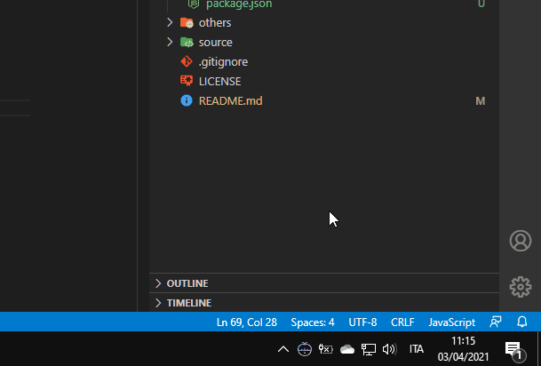

# Pomodoro c3
A pomodoro clock living in Windows taskbar. It shows notification when a pomodoro finishes.

_For the moment it is just a tech test. In the next few days I will be talking about it on [Patreon](https://www.patreon.com/el3um4s) and on my [blog](https://blog.stranianelli.com/)._




### How to use

In folder `app`, run

```
npm install
```

Then run

```
npm run start
```
